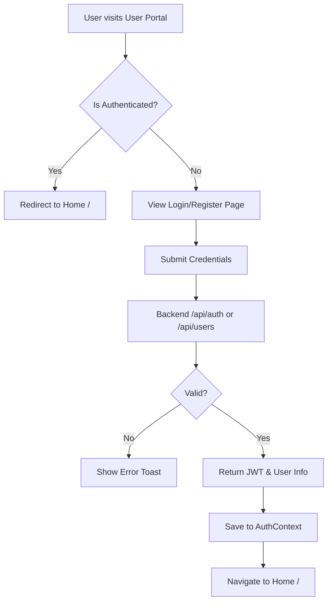
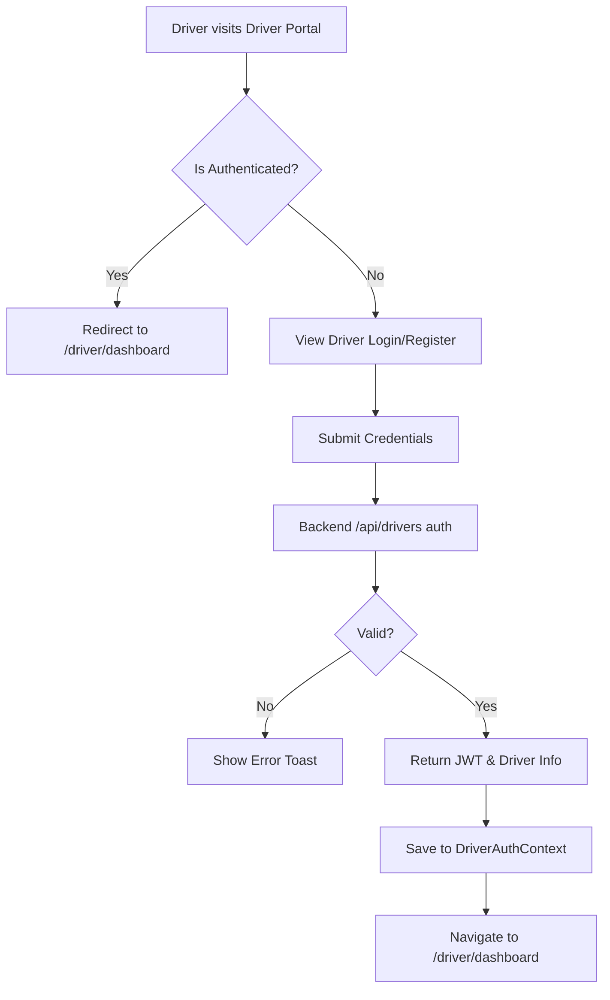
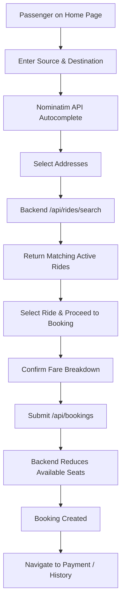
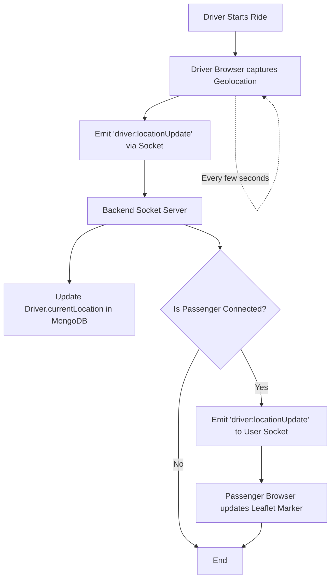

# CarPool Application Flows

## 1. User Authentication Flow

```mermaid
flowchart TD
    A[User visits User Portal] --> B{Is Authenticated?}
    B -- Yes --> C[Redirect to Home /]
    B -- No --> D[View Login/Register Page]
    D --> E[Submit Credentials]
    E --> F[Backend /api/auth or /api/users]
    F --> G{Valid?}
    G -- No --> H[Show Error Toast]
    G -- Yes --> I[Return JWT & User Info]
    I --> J[Save to AuthContext]
    J --> K[Navigate to Home /]
```

## 2. Driver Authentication Flow

```mermaid
flowchart TD
    A[Driver visits Driver Portal] --> B{Is Authenticated?}
    B -- Yes --> C[Redirect to /driver/dashboard]
    B -- No --> D[View Driver Login/Register]
    D --> E[Submit Credentials]
    E --> F[Backend /api/drivers auth]
    F --> G{Valid?}
    G -- No --> H[Show Error Toast]
    G -- Yes --> I[Return JWT & Driver Info]
    I --> J[Save to DriverAuthContext]
    J --> K[Navigate to /driver/dashboard]
```

## 3. Ride Booking Flow

```mermaid
flowchart TD
    A[Passenger on Home Page] --> B[Enter Source & Destination]
    B --> C[Nominatim API Autocomplete]
    C --> D[Select Addresses]
    D --> E[Backend /api/rides/search]
    E --> F[Return Matching Active Rides]
    F --> G[Select Ride & Proceed to Booking]
    G --> H[Confirm Fare Breakdown]
    H --> I[Submit /api/bookings]
    I --> J[Backend Reduces Available Seats]
    J --> K[Booking Created]
    K --> L[Navigate to Payment / History]
```

## 4. Real-Time Location Tracking Flow

```mermaid
flowchart TD
    A[Driver Starts Ride] --> B[Driver Browser captures Geolocation]
    B --> C[Emit 'driver:locationUpdate' via Socket]
    C --> D[Backend Socket Server]
    D --> E[Update Driver.currentLocation in MongoDB]
    D --> F{Is Passenger Connected?}
    F -- Yes --> G[Emit 'driver:locationUpdate' to User Socket]
    G --> H[Passenger Browser updates Leaflet Marker]
    F -- No --> I[End]
    H --> I
    
    %% Loop
    B -.-> |Every few seconds| B
```
